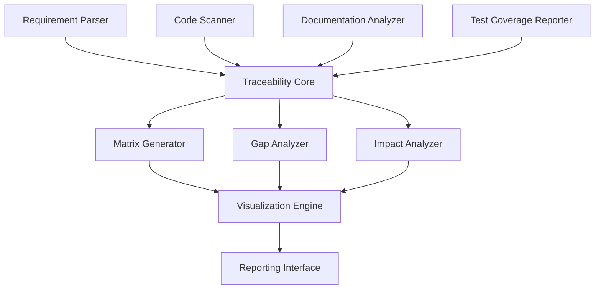

# Automated Traceability Matrix Generation System

This document outlines the design and implementation of the Automated Traceability Matrix Generation system for the Cline-Powered Multi-Brand AI Agent System.

## 1. Overview

The Automated Traceability Matrix Generation system is designed to automatically create, maintain, and validate traceability relationships between requirements, design elements, implementation artifacts, and test cases across the entire system. This ensures comprehensive coverage of all requirements and facilitates impact analysis, compliance verification, and project management.

## 2. System Architecture

The Traceability Matrix Generation system consists of the following components:



### 2.1 Components

1. **Requirement Parser**
   - Extracts requirements from various sources (PRDs, user stories, specifications)
   - Assigns unique identifiers to each requirement
   - Tracks requirement versions and changes

2. **Code Scanner**
   - Analyzes source code for implementation of requirements
   - Identifies code elements that fulfill specific requirements
   - Detects code changes that impact requirements

3. **Documentation Analyzer**
   - Scans documentation for references to requirements
   - Validates documentation coverage of requirements
   - Ensures ISO/IEC 26514 compliance

4. **Test Coverage Reporter**
   - Maps test cases to requirements and code
   - Tracks test execution and results
   - Identifies untested requirements

5. **Traceability Core**
   - Maintains the traceability graph database
   - Manages relationships between elements
   - Provides query and analysis capabilities

6. **Matrix Generator**
   - Creates traceability matrices in various formats
   - Supports customizable matrix views
   - Generates matrices for specific subsets of the system

7. **Gap Analyzer**
   - Identifies requirements without implementation
   - Detects code without requirements
   - Finds untested functionality

8. **Impact Analyzer**
   - Assesses the impact of changes to requirements
   - Predicts affected components for code changes
   - Provides change propagation analysis

9. **Visualization Engine**
   - Creates interactive visualizations of traceability data
   - Provides drill-down capabilities
   - Supports different visualization formats

10. **Reporting Interface**
    - Generates compliance reports
    - Creates status reports for project management
    - Provides customizable reporting templates

## 3. Traceability Relationships

The system tracks the following relationship types:

1. **Requirement → Requirement**
   - Parent-child relationships
   - Dependencies
   - Refinements

2. **Requirement → Design**
   - Architectural components
   - Data models
   - Interface specifications

3. **Requirement → Implementation**
   - Source code files
   - Functions and methods
   - Configuration parameters

4. **Requirement → Test**
   - Test cases
   - Test scenarios
   - Acceptance criteria

5. **Requirement → Documentation**
   - User documentation
   - API documentation
   - Technical specifications

## 4. Matrix Types

The system supports generation of several matrix types:

1. **Requirements Traceability Matrix (RTM)**
   - Maps requirements to their implementations
   - Shows test coverage for each requirement
   - Identifies documentation coverage

2. **Coverage Matrix**
   - Displays test coverage percentage for requirements
   - Shows implementation coverage of requirements
   - Presents documentation coverage metrics

3. **Impact Analysis Matrix**
   - Shows dependencies between components
   - Identifies impact of proposed changes
   - Predicts risk levels for modifications

4. **Compliance Matrix**
   - Maps requirements to compliance standards
   - Tracks verification status for compliance items
   - Identifies compliance gaps

## 5. Implementation Plan

### Phase 1: Core Infrastructure

1. **Design Traceability Data Model**
   - Define entity types and relationships
   - Create schema for traceability database
   - Implement versioning and history tracking

2. **Implement Requirement Parser**
   - Create parsers for various requirement formats
   - Develop requirement identification algorithms
   - Implement change detection

3. **Build Basic Matrix Generator**
   - Create core matrix generation engine
   - Implement basic matrix formats
   - Develop export capabilities

### Phase 2: Integration and Analysis

1. **Implement Code Scanner**
   - Develop source code analyzers
   - Create annotation processing
   - Build code-to-requirement mapping

2. **Integrate with Testing Framework**
   - Connect to test execution systems
   - Implement test coverage analysis
   - Create test-to-requirement mapping

3. **Develop Gap Analysis**
   - Implement coverage analysis algorithms
   - Create gap detection logic
   - Develop prioritization for gap remediation

### Phase 3: Visualization and Reporting

1. **Build Visualization Engine**
   - Create interactive visualizations
   - Implement filtering and customization
   - Develop drill-down capabilities

2. **Implement Reporting System**
   - Create report templates
   - Develop scheduling and distribution
   - Implement customizable reports

3. **Develop User Interface**
   - Build web-based interface
   - Implement matrix customization
   - Create dashboard views

## 6. Integration with ISO/IEC 26514 Compliance

The Automated Traceability Matrix Generation system will directly support ISO/IEC 26514 compliance by:

1. **Documentation Completeness Verification**
   - Ensuring all requirements have corresponding documentation
   - Validating that all system features are documented
   - Tracking documentation updates in response to requirement changes

2. **Consistency Checking**
   - Identifying inconsistencies between requirements and documentation
   - Detecting terminology variations across documentation
   - Ensuring uniform documentation coverage across features

3. **Change Impact Analysis**
   - Identifying documentation that needs updating when requirements change
   - Highlighting affected documentation sections for review
   - Tracking documentation update status after changes

4. **Compliance Reporting**
   - Generating reports showing documentation compliance status
   - Providing metrics for documentation quality assessment
   - Creating evidence for compliance audits

## 7. API and Integration

The system will provide the following integration capabilities:

### 7.1 REST API

```javascript
// Example API endpoints
GET /api/requirements
GET /api/requirements/{id}
GET /api/requirements/{id}/traces
GET /api/matrices/generate
POST /api/analyze/impact
GET /api/reports/compliance
```

### 7.2 Webhooks

```javascript
// Example webhook registration
POST /api/webhooks/register
{
  "event": "requirement.changed",
  "url": "https://example.com/webhook/requirement-changed",
  "secret": "your-webhook-secret"
}
```

### 7.3 GraphQL API

```graphql
# Example GraphQL query
query {
  requirement(id: "REQ-001") {
    id
    title
    description
    version
    traces {
      type
      target {
        id
        type
        name
      }
    }
    coverage {
      implementation
      test
      documentation
    }
  }
}
```

## 8. Success Metrics

The success of the Automated Traceability Matrix Generation system will be measured by:

1. **Traceability Coverage**
   - Percentage of requirements with complete traceability
   - Percentage of code linked to requirements
   - Percentage of tests mapped to requirements

2. **Time Savings**
   - Reduction in time spent on manual traceability maintenance
   - Decrease in effort for impact analysis
   - Time saved during compliance audits

3. **Defect Reduction**
   - Decrease in defects caused by incomplete requirement implementation
   - Reduction in documentation gaps
   - Fewer regression issues from changes

4. **Compliance Efficiency**
   - Reduction in time to prepare for compliance audits
   - Decrease in compliance findings
   - Faster resolution of compliance issues

## 9. Roadmap

### Q3 2025
- Complete Phase 1 implementation
- Basic requirement parsing and matrix generation
- Initial integration with code repositories

### Q4 2025
- Complete Phase 2 implementation
- Full code and test integration
- Gap analysis capabilities

### Q1 2026
- Complete Phase 3 implementation
- Advanced visualization and reporting
- Full compliance integration

## 10. Conclusion

The Automated Traceability Matrix Generation system will provide comprehensive traceability across the entire Cline-Powered Multi-Brand AI Agent System, ensuring that all requirements are properly implemented, tested, and documented. This will significantly improve project management, quality assurance, and compliance verification while reducing manual effort and potential for errors.
