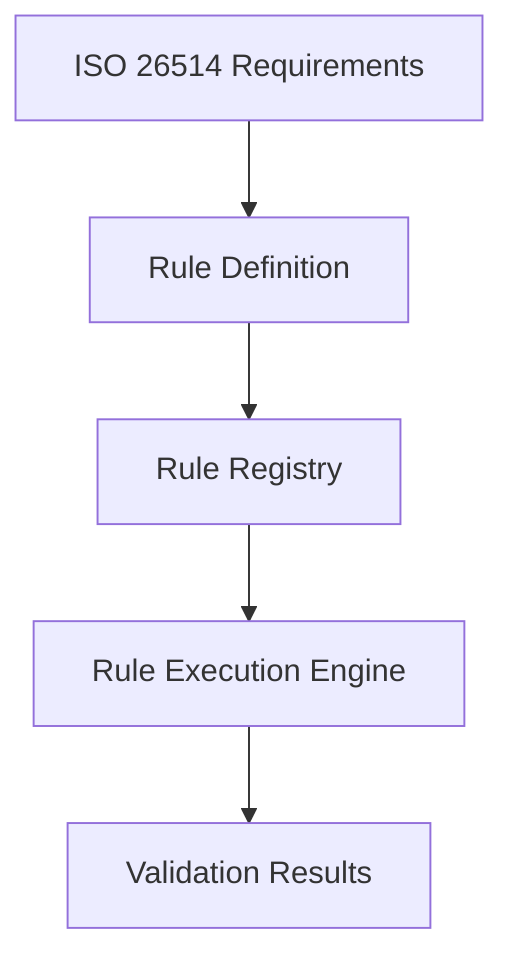

# ISO/IEC 26514 Compliance Validation Framework

This document outlines the implementation of a compliance validation framework for ensuring adherence to ISO/IEC 26514 standards in the Cline-Powered Multi-Brand System.

## 1. Overview of ISO/IEC 26514

ISO/IEC 26514 is an international standard that provides requirements for the design and development of software user documentation. Compliance with this standard ensures that documentation is consistent, comprehensive, and user-focused.

### Key Areas of ISO/IEC 26514 Clause 7.4

Clause 7.4 of ISO/IEC 26514 specifically focuses on documentation quality attributes:

1. **Completeness** - Documentation covers all necessary aspects of the system
2. **Correctness** - Information is accurate and error-free
3. **Consistency** - Terminology, style, and formatting are uniform throughout
4. **Clarity** - Information is presented clearly and is easy to understand
5. **Accessibility** - Documentation is accessible to all users, including those with disabilities
6. **Maintainability** - Documentation is structured for easy updates and version control

## 2. Compliance Validation Architecture

The compliance validation framework will be implemented with the following components:

### 2.1 Rules Engine

A flexible rules engine that encodes ISO/IEC 26514 requirements as executable validation rules:



### 2.2 Validation Pipeline

A multi-stage validation process that checks documentation at various points:

1. **Pre-generation Validation** - Validates templates and inputs before content generation
2. **In-process Validation** - Validates content during the generation process
3. **Post-generation Validation** - Validates final output for compliance
4. **Continuous Validation** - Monitors documentation for ongoing compliance

### 2.3 Reporting System

A comprehensive reporting system that provides:

1. **Compliance Dashboards** - Visual representation of compliance status
2. **Detailed Reports** - In-depth analysis of compliance issues
3. **Remediation Suggestions** - AI-powered suggestions for fixing compliance issues
4. **Traceability Matrix** - Mapping between requirements and implementation

## 3. Implementation Plan

### Phase 1: Rule Definition and Implementation

1. **Document ISO/IEC 26514 Requirements**
   - Break down Clause 7.4 into discrete, testable requirements
   - Create validation criteria for each requirement
   - Define severity levels for different types of compliance issues

2. **Implement Core Rules Engine**
   - Develop rule definition schema
   - Create rule registration system
   - Implement rule execution framework
   - Develop rule testing capabilities

3. **Create Initial Rule Set**
   - Implement completeness validation rules
   - Develop correctness validation rules
   - Create consistency validation rules
   - Implement clarity analysis rules
   - Develop accessibility validation rules
   - Create maintainability assessment rules

### Phase 2: Integration with Content Generation

1. **Implement Pre-generation Validation**
   - Integrate with template management system
   - Create input validation mechanisms
   - Implement early warning system for potential issues

2. **Develop In-process Validation**
   - Create hooks into content generation pipeline
   - Implement real-time validation feedback
   - Develop correction suggestion system

3. **Build Post-generation Validation**
   - Create comprehensive validation workflows
   - Implement batch validation for existing content
   - Develop detailed reporting mechanisms

### Phase 3: Reporting and Continuous Improvement

1. **Develop Compliance Dashboard**
   - Create visual representation of compliance status
   - Implement trend analysis and tracking
   - Develop drill-down capabilities for issue investigation

2. **Implement Remediation Workflow**
   - Create issue tracking and assignment
   - Develop automated remediation suggestions
   - Implement validation of fixes

3. **Build Continuous Improvement System**
   - Create feedback loop for rule refinement
   - Implement rule effectiveness metrics
   - Develop machine learning for improved validation

## 4. Validation Rules Examples

### 4.1 Completeness Rules

```javascript
// Example rule structure
{
  id: "COMP-001",
  name: "Required Sections Check",
  description: "Validates that all required sections are present in documentation",
  category: "Completeness",
  severity: "Critical",
  validate: function(document) {
    const requiredSections = ["Introduction", "System Overview", "Installation", "Configuration", "Usage"];
    const missingSections = requiredSections.filter(section => !document.hasSection(section));
    
    return {
      valid: missingSections.length === 0,
      issues: missingSections.map(section => ({
        message: `Missing required section: ${section}`,
        location: "document.structure",
        remediation: `Add a ${section} section to the document`
      }))
    };
  }
}
```

### 4.2 Consistency Rules

```javascript
// Example rule structure
{
  id: "CONS-003",
  name: "Terminology Consistency",
  description: "Checks that terminology is used consistently throughout documentation",
  category: "Consistency",
  severity: "Major",
  validate: function(document) {
    const terminologyMap = buildTerminologyMap(document);
    const inconsistencies = findTerminologyInconsistencies(terminologyMap);
    
    return {
      valid: inconsistencies.length === 0,
      issues: inconsistencies.map(inconsistency => ({
        message: `Inconsistent terminology: "${inconsistency.term1}" vs "${inconsistency.term2}"`,
        location: inconsistency.locations.join(", "),
        remediation: `Standardize on either "${inconsistency.term1}" or "${inconsistency.term2}"`
      }))
    };
  }
}
```

## 5. Integration with Traceability Matrix

The compliance validation framework will integrate with the automated traceability matrix generation system to ensure complete coverage of ISO/IEC 26514 requirements:

1. **Requirement Mapping** - Each validation rule will be mapped to specific requirements in ISO/IEC 26514
2. **Coverage Analysis** - The system will analyze which requirements are covered by validation rules
3. **Gap Identification** - Gaps in validation coverage will be identified and highlighted
4. **Impact Analysis** - Changes to documentation or validation rules will be analyzed for their impact on compliance

## 6. Success Metrics

The following metrics will be used to measure the success of the compliance validation framework:

1. **Compliance Rate** - Percentage of documentation that passes all validation rules
2. **Issue Density** - Number of compliance issues per page or section
3. **Resolution Time** - Average time to resolve compliance issues
4. **Coverage Percentage** - Percentage of ISO/IEC 26514 requirements covered by validation rules
5. **False Positive Rate** - Percentage of reported issues that are not actual compliance problems
6. **User Satisfaction** - Feedback from users on documentation quality

## 7. Roadmap

### Q3 2025
- Complete Phase 1 implementation
- Develop core validation rules
- Create initial integration with content generation

### Q4 2025
- Complete Phase 2 implementation
- Implement comprehensive validation pipeline
- Integrate with brand context management

### Q1 2026
- Complete Phase 3 implementation
- Deploy compliance dashboard
- Implement continuous improvement system

## 8. Conclusion

The ISO/IEC 26514 compliance validation framework will ensure that all documentation produced by the Cline-Powered Multi-Brand System meets international standards for quality and usability. By automating compliance validation, the system will reduce manual review effort, improve documentation quality, and ensure consistent adherence to standards across all brands and products.
