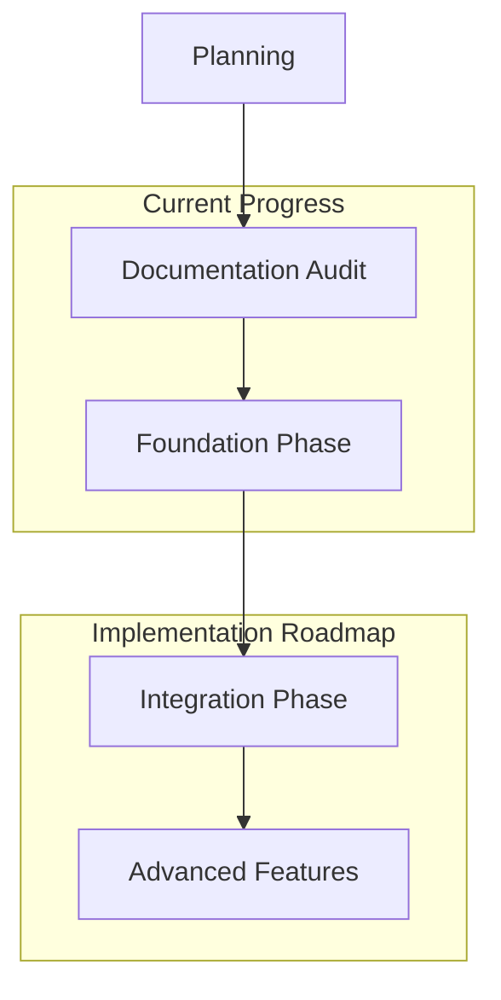

# Implementation Progress

## Completed Milestones
✅ Monorepo Foundation Completed (2025-06-25)
✅ Documentation Audit Completed (2025-06-25)
✅ ISO/IEC 26514 Compliance Framework Defined (2025-06-25)
✅ Automated Traceability Matrix System Designed (2025-06-25)
✅ Implementation Plan with Task Complexity Analysis (2025-06-25)

## Current Phase
🔄 **Foundation Phase (Q3 2025)**
- Core Documentation Infrastructure Setup
- Validation Framework Implementation
- Traceability System Foundation Development

## Next Steps
1. AI Infrastructure Setup
   - ✅ MCP Server Integration (2025-06-26)
   - ✅ Brand Context Management System (2025-06-26)
   - ✅ AI Agent Orchestration Layer (OpenAI & Anthropic SDKs Integrated - 2025-06-27)
   - ✅ AI Agent Orchestration Layer (Implemented Ollama and Custom Model Execution - 2025-06-27)
2. MCP Server Generation
   - Five Specialized MCP Servers Implementation
   - AI Model Integration
   - Workflow Orchestration 
3. Frontend Scaffolding
   - Next.js 14 with App Router Implementation
   - Multi-Brand Dashboard Development

## Future Phases
### Integration Phase (Q4 2025)
- Documentation Integration with Content Generation
- Validation Enhancement and Rule Development
- Traceability System Enhancement

### Advanced Features Phase (Q1 2026)
- Documentation Refinement and Analytics
- Validation System Dashboard and Scoring
- Traceability Visualization and Reporting

## Success Metrics Tracking
| Metric | Target | Current Status |
|--------|--------|---------------|
| Documentation Coverage | 100% | In Progress |
| ISO/IEC 26514 Compliance | 100% | Framework Defined |
| Automated Documentation Sync | 95% | Planning Stage |
| Brand Context Switching | <50ms | Design Phase |
| Manual Intervention in CI/CD | Zero | Planning Stage |
| User Documentation Satisfaction | >90% | Not Started |
