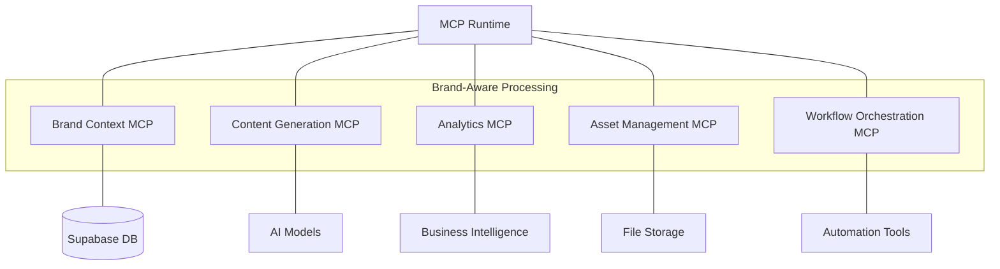

# Specialized MCP Servers for Multi-Brand AI System

## Overview

This document details the five specialized Model-Context Protocol (MCP) servers that form the core of the Cline-Powered Multi-Brand AI Agent System. These servers handle different aspects of the system's AI functionality, each with specific responsibilities and integration points.

## MCP Server Architecture

The Multi-Brand AI System is built around five specialized MCP servers that communicate through a central MCP runtime. Each server provides specific AI capabilities to the overall system while maintaining brand awareness and context isolation.

## 1. Brand Context MCP Server

**Primary Responsibility**: Manage brand identity, context persistence, and isolation across the system.

### Key Features

- **Brand Detection**: Analyzes input to determine the intended brand from user selection or content cues
- **Context Locking**: Establishes a context lock to ensure subsequent operations respect brand boundaries
- **Context Validation**: Validates that content or actions align with brand guidelines
- **Context Switching**: Manages transitions between brands by loading new settings and clearing in-memory context

### Integration Points

- **First Touch**: Acts as the first server in the chain for any brand-related request
- **Database**: Reads and writes brand configurations from Supabase
- **UI Layer**: Provides brand context to the user interface for proper theming and content display
- **Other MCP Servers**: Feeds brand context to other servers to ensure brand-appropriate processing

### Implementation Details

- **Brand Context Model**: JSON schema defining brand properties (voice, style, audience, etc.)
- **Context Persistence**: Maintains session-based context in memory with database backup
- **Context Validation Rules**: Brand-specific rules that validate content against guidelines
- **JWT Integration**: Works with authentication tokens that include brand permissions

## 2. Content Generation MCP Server

**Primary Responsibility**: Handle all AI-driven content creation with brand-specific voice and style.

### Key Features

- **Model Selection**: Chooses appropriate AI model based on brand and content type
- **Voice Consistency**: Enforces brand voice guidelines during generation
- **Template Management**: Applies brand-specific templates to structured content
- **Content Transformation**: Processes raw AI outputs into final formatted content
- **Fallback Handling**: Implements retry strategies and model switching when needed

### Integration Points

- **AI Models**: Connects to OpenAI, Anthropic Claude, and Ollama for content generation
- **Brand Context MCP**: Receives brand context to ensure appropriate tone and style
- **Asset Management MCP**: Coordinates with asset server for content that requires media
- **Database**: Logs generation results and caches frequent content

### Implementation Details

- **Prompt Engineering**: Brand-specific prompts that guide AI models
- **Content Types**: Supports blog posts, social media, email, product descriptions, etc.
- **Caching Strategy**: Implements efficient caching to improve performance
- **Quality Control**: Post-processing to ensure consistent quality and brand alignment

## 3. Analytics MCP Server

**Primary Responsibility**: Gather, analyze, and visualize performance data across brands.

### Key Features

- **Data Collection**: Aggregates metrics from all system components
- **Brand Segmentation**: Maintains strict separation of brand analytics
- **Portfolio Insights**: Identifies cross-brand trends and opportunities
- **Predictive Analytics**: Forecasts performance and suggests optimizations
- **Report Generation**: Creates visualizations and dashboards for stakeholders

### Integration Points

- **Database**: Reads from and writes to analytics tables in Supabase
- **External Analytics**: Integrates with Google Analytics, social platforms, etc.
- **Dashboard**: Feeds data to the Next.js admin interface
- **Content Generation MCP**: Provides performance feedback to improve content strategy

### Implementation Details

- **Metrics Schema**: Comprehensive data model for tracking all relevant metrics
- **Real-time Processing**: Handles streaming analytics for immediate insights
- **Visualization Components**: Reusable charts and graphs for dashboards
- **Data Warehouse**: Optional integration with dedicated analytics database

## 4. Asset Management MCP Server

**Primary Responsibility**: Manage brand-specific media, templates, and files.

### Key Features

- **File Organization**: Maintains brand-specific folder structures and naming conventions
- **Asset Tagging**: Implements metadata system for asset categorization
- **Template Management**: Stores and retrieves brand-specific templates
- **Media Processing**: Handles image resizing, format conversion, etc.
- **Cross-brand Assets**: Manages shared resources with brand-specific implementations

### Integration Points

- **File Storage**: Connects to Google Drive, Supabase Storage, or other storage solutions
- **Content Generation MCP**: Provides assets for content that requires media
- **Brand Context MCP**: Ensures assets match brand guidelines
- **Frontend**: Delivers assets to the admin dashboard and brand sites

### Implementation Details

- **Storage Architecture**: Hierarchical structure with brand isolation
- **Asset Pipeline**: Workflow for asset creation, processing, and publishing
- **Permission Model**: Access controls based on brand context
- **Version Control**: Tracks asset versions and historical changes

## 5. Workflow Orchestration MCP Server

**Primary Responsibility**: Coordinate complex, multi-step processes across the system.

### Key Features

- **Workflow Definition**: Manages sequences of operations across multiple servers
- **State Management**: Tracks progress of workflows and maintains context
- **Error Handling**: Implements retry strategies and fallbacks for failed steps
- **Branching Logic**: Supports conditional paths based on brand requirements
- **Scheduling**: Manages timed and triggered workflows

### Integration Points

- **All MCP Servers**: Coordinates actions across all specialized servers
- **Automation Tools**: Integrates with n8n, Zapier, or custom automation engines
- **External Triggers**: Listens for webhooks, scheduled events, etc.
- **User Interface**: Provides workflow status updates to the dashboard

### Implementation Details

- **Workflow Schema**: JSON definition format for workflow steps
- **State Machine**: Implements formal state transitions for reliable execution
- **Distributed Transactions**: Ensures consistency across multiple operations
- **Monitoring**: Comprehensive logging and alerting for workflow status

## Implementation Plan

The implementation of these specialized MCP servers will follow the phases outlined in the project plan:

### Phase 1: Foundation (Q3 2025)

- Basic server structure setup
- Initial brand context model
- Simple content generation capabilities
- Core workflow definitions
- File storage integration

### Phase 2: Integration (Q4 2025)

- Enhanced brand context management
- Advanced content generation with multiple models
- Comprehensive analytics collection
- Sophisticated asset management
- Complex workflow orchestration

### Phase 3: Advanced Features (Q1 2026)

- AI-powered brand context validation
- Cross-brand content optimization
- Predictive analytics and recommendations
- Intelligent asset suggestion
- Self-optimizing workflows

## Conclusion

These five specialized MCP servers form the backbone of the Cline-Powered Multi-Brand AI Agent System. By maintaining clear separation of concerns while sharing a common brand context protocol, they enable sophisticated AI-driven functionality with strict brand isolation. This architecture ensures scalability, maintainability, and brand fidelity across the entire platform.
