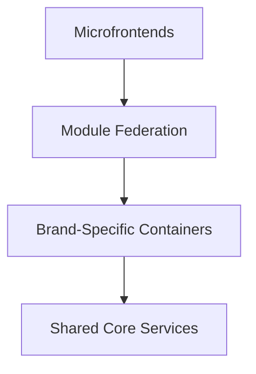

# System Architecture Patterns

```mermaid
graph TD
    A[Microfrontends] --> B[Module Federation]
    B --> C[Brand-Specific Containers]
    C --> D[Shared Core Services]
```

## Core Principles
1. Brand Isolation via CSS Variables
2. JWT-based Tenant Identification  
3. Feature Flag Registry
4. Automated CSP Generation
