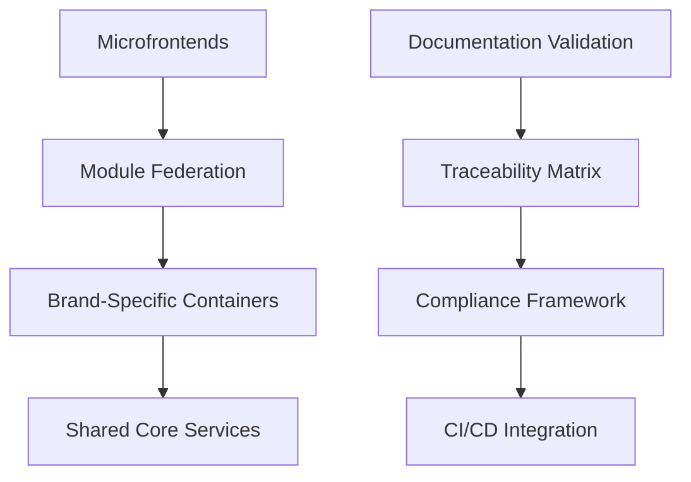

# System Architecture Patterns - Updated (June 2025)

## Core Principles
1. Brand Isolation via CSS Variables
2. JWT-based Tenant Identification  
3. Feature Flag Registry
4. Automated CSP Generation
5. ISO/IEC 26514 Documentation Compliance
6. Automated Traceability

## Documentation & Compliance Patterns

### 1. Documentation Validation Pattern
- **Purpose**: Ensure all documentation meets ISO/IEC 26514 standards
- **Components**:
  - Rule-based validation engine
  - Quality attribute verification
  - Correction suggestion system
  - Validation reporting
- **Integration Points**:
  - Content generation pipeline
  - CI/CD system
  - Documentation publishing workflow
- **Implementation**: A multi-stage validation pipeline that checks documentation against compliance rules before publishing

### 2. Traceability Matrix Pattern
- **Purpose**: Maintain relationships between requirements, implementation, and documentation
- **Components**:
  - Requirement parser
  - Implementation scanner
  - Documentation linker
  - Matrix generator
  - Impact analysis engine
- **Integration Points**:
  - Code repositories
  - Documentation system
  - Requirements management
  - CI/CD pipeline
- **Implementation**: An automated system that generates and maintains traceability matrices to ensure complete coverage

### 3. Brand-Aware Documentation Pattern
- **Purpose**: Ensure documentation respects brand boundaries while sharing common structures
- **Components**:
  - Brand context detection
  - Template system with brand parameters
  - Style guide enforcement
  - Terminology management
- **Integration Points**:
  - Brand Context MCP
  - Content Generation MCP
  - Documentation CI/CD
- **Implementation**: Documentation generation that respects brand contexts while leveraging shared structures

### 4. Continuous Documentation Integration Pattern
- **Purpose**: Keep documentation in sync with code changes automatically
- **Components**:
  - Documentation CI/CD pipeline
  - Change detection system
  - Automatic update triggers
  - Validation gates
- **Integration Points**:
  - Code repositories
  - CI/CD system
  - Documentation publishing
- **Implementation**: Automated pipeline that detects code changes, updates documentation, validates compliance, and publishes updates
