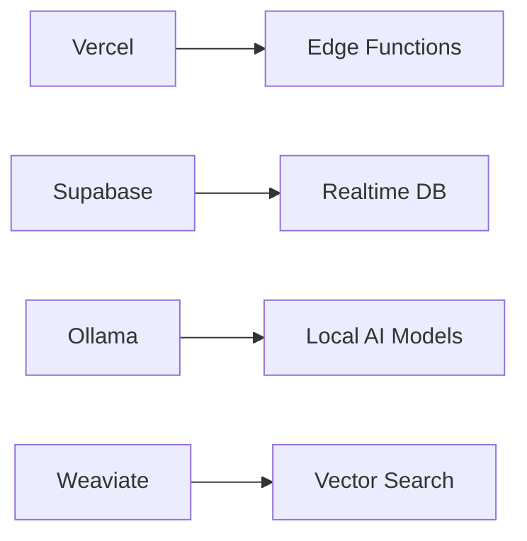

# Technical Context

# Technology Stack – Multi-Brand AI Automation Suite

## 1. Core Platform & Monorepo

- **Monorepo Management:** Nx/Turborepo for managing multiple apps and packages in one repo, enabling shared code and synchronized deployments. This houses the Next.js admin dashboard, any brand-specific frontends, and all server code (including MCP servers and utilities).
    
- **Package Management:** pnpm (preferred for its speed and workspace features) or npm/yarn as alternatives. Workspaces are used to link shared packages (UI library, types, etc.) across the monorepo.
    

## 2. Web Applications (Frontend)

- **Admin Dashboard:** Next.js 13+ (React) as the central web application. The dashboard provides a unified interface to manage all brands, with a built-in brand selector and context-aware pages. It uses TypeScript and modern React features, ensuring a responsive and dynamic UX. (Remix or other React frameworks could be alternatives, but Next’s App Router suits multi-tenant SPAs well.)
    
- **Brand Hub Pages/Sites:** Each brand can have its own public-facing site or section. This can be implemented as static sites (Astro or Next.js static generation) or as part of the Next.js app as dynamic routes per brand. The content is fetched via common APIs but rendered with brand-specific theming. For example, SaithavyS might have a marketing site built in Astro, pulling blog content via the shared CMS, whereas Partly Office’s site might be a Next.js app within the monorepo. All brand sites share components from a common library where possible (header, footer, etc., styled per brand via Tailwind themes).
    
- **UI Components:** A shared component library (Monorepo `/packages/ui`) built with **Tailwind CSS** and possibly component frameworks like Chakra or Material as needed. This library includes reusable UI elements that adapt to brand themes (colors, logos). Interactivity uses Alpine.js or plain React hooks for simple components, ensuring lightweight brand sites. This consistency guarantees that the admin dashboard and brand sites have a coherent look and feel, while still allowing brand-specific customization via context.
    

## 3. Backend & APIs

- **Database (Multi-Brand):** **Supabase (PostgreSQL)** is the primary database, structured for multi-brand data. Core tables include `brand_hubs` (listing each brand and its configuration), `content_templates`, `workflows`, `tasks`, `brand_content` (generated content pieces), `performance_metrics`, etc. Each content or workflow record links to a `brand_hub_id` to segregate data. **Row-Level Security (RLS)** policies are heavily used to enforce that each brand’s data is isolated — queries from the admin or from an agent must include the appropriate brand context to retrieve data. Supabase also provides real-time capabilities (used for live content status updates and analytics feeds in the dashboard).
    
- **ORM & Schema:** The application uses a type-safe ORM (such as **Drizzle ORM** or Prisma) to interact with the Postgres database. This ensures compile-time verification of queries and easy migrations. All migrations and schema changes are versioned (with tools like Supabase migration scripts), aligning with the zero-cost and open-source approach.
    
- **APIs & Edge Functions:** Backend logic is exposed via **Supabase Edge Functions** (serverless functions in TypeScript) and custom API routes (using Next.js API routes or a dedicated Hono.js server for high-performance routing). These handle tasks like content generation requests, file uploads, and webhook receivers. They are designed to be stateless, relying on JWTs and Supabase Auth for security. For example, an edge function might be triggered by an incoming webhook (from a form on a brand site) to enqueue a task in the system.
    
- **Authentication & Authorization:** **Supabase Auth** provides user management with support for email magic links and social logins as needed. Role-based access control is implemented such that an admin user can manage all brands, whereas brand-specific editors only see their brand’s content. Auth tokens include a `role` and allowed `brand_ids` claims, which the front-end and back-end both respect (the front-end will hide other brands’ sections, and back-end RLS will enforce data separation). Single sign-on (SSO) can be configured for internal users if required.
    

## 4. AI & Automation Integrations

- **AI Language Models:** The platform integrates with multiple AI/ML services for content generation and analysis. Primary models include **OpenAI’s GPT-4** and **Anthropic’s Claude 2** via API for high-quality text generation. Additionally, **local LLMs** (such as those served by Ollama or similar local inference engines) are used to ensure data privacy and reduce costs for certain tasks. The system can route requests to the appropriate model based on brand and task (e.g., use GPT-4 for creative copy for SaithavyS, but use a local model for quick minor tasks).
    
- **AI Orchestration (Agents):** At the core of the AI integration is **Cline 3.0 and the Model-Context Protocol (MCP)**. This serves as the orchestration layer connecting our specialized AI agents (MCP servers) with the rest of the stack. It abstracts the model calls and tool usage behind a consistent interface. For instance, when the system needs to generate a blog post, it doesn’t call GPT-4 directly from the front-end; it sends a request to the Content Generation MCP server, which then picks the right model and parameters. This orchestration ensures all AI actions are logged and can be controlled (e.g. one can set a max length or require a brand guideline check after generation).
    
- **Workflow Automation Engines:** We use **n8n**, a self-hostable workflow automation tool (or alternatively, integration with Zapier for specific apps), to automate multi-step processes. N8n workflows are configured to be _brand-aware_ by including brand IDs in their triggers and actions. For example, an n8n workflow might check for new leads in a Google Sheet and then queue a personalized follow-up email draft via our AI Content service for the relevant brand’s tone. These workflows run either on a schedule or event-based triggers. The MCP Workflow Orchestration server communicates with n8n through webhooks or its API to start or continue flows as needed. This combination provides a **low-code automation layer** tightly integrated with our AI and database.
    
- **External Service Integrations:**
    
    - **Email/Newsletter:** Services like Resend or Mailchimp are connected via API for sending emails. The system can automatically draft emails (using the AI agents) and then use Resend’s API to send them out, segmented by brand audience lists.
        
    - **Social Media:** The platform integrates scheduling and posting to social media. For instance, it might use Twitter/Facebook/LinkedIn APIs (possibly coordinated through a tool like Buffer or directly) to publish content. AI-generated social posts are reviewed and then an automation (via n8n or Supabase Functions) handles actual posting at scheduled times. The system also stores social performance stats per post in the database for analytics.
        
    - **File Storage & CMS:** Google Drive acts as a backing store for large assets and an easy CMS for non-structured content (like images, PDFs, or raw text docs). A structured content repository is also available via Supabase (tables for content and versioning). For rich content editing, Notion’s API could be integrated – e.g. content creators can write in Notion, and an automation syncs it into the system’s database or triggers an AI enhancement.
        
    - **E-commerce (Optional):** For brands that require e-commerce, Stripe’s API is integrated. This can be used to sell digital products or subscriptions on a brand’s site. While Stripe is not core to all brands, the code is structured as a module that can be enabled per brand. Payment webhooks (for purchases, refunds) are handled by Supabase Functions to update the database and potentially trigger workflows (like sending a personalized thank-you email via AI).
        
- **Analytics & Monitoring:** Each user interaction and automation result can be logged for analysis. The stack includes event logging to Supabase (leveraging Postgres functions or a tool like Logflare). On the front-end, we can use something like Ackee or a simple script for page views to avoid external analytics for privacy – or integrate privacy-compliant Google Analytics per brand. **Looker Studio (Google Data Studio)** or Metabase is used on top of the Supabase DB to create dashboards. These display both aggregate KPIs and per-brand metrics in near real-time. The Analytics MCP server also feeds data into these dashboards by writing computed insights back into special tables or directly to an internal API consumed by the Next.js dashboard.
    

## 5. DevOps & Deployment

- **CI/CD Pipeline:** GitHub Actions is configured to test and deploy the monorepo. Linting, tests, and build processes run on each push. The CI can separately package the Next.js app (for deployment to Vercel or a container) and each MCP server (which could be published as Docker images). Migrations are automatically run against the Supabase database on deployment. The goal is a one-click (or one-merge) deployment that updates all components of the system.
    
- **Hosting & Infrastructure:**
    
    - _Frontend:_ Deployed on Vercel or Netlify for ease of use, taking advantage of edge functions for any dynamic serverless API routes.
        
    - _MCP Servers:_ Can be hosted on a VPS or container platform. For instance, a lightweight Kubernetes cluster might run each MCP service as a pod, or a simpler approach using PM2 on a single VM for all five services in small-scale scenarios. Since all MCP services are stateless and communicate via HTTP or RPC, they can also be scaled out behind a load balancer if needed.
        
    - _Database:_ Supabase’s managed hosting (or a self-hosted Postgres if required) handles the database, including regular backups, row-level security policies, and ACID transactions for consistency.
        
- **Secrets & Config:** Environment variables are used for all sensitive keys (API keys for AI services, database service role key, OAuth secrets, etc.). Each environment (development, staging, production) has its own .env file or secure config store. We rotate keys periodically and never commit them to the repo. The use of a central secrets manager (like Doppler or 1Password Connect) is considered to sync secrets across the MCP servers and Next.js app.
    
- **Zero-Cost Principle:** The entire tech stack is chosen to minimize licensing fees. Supabase offers a generous free tier and open-source self-hosting option; n8n is open source; Next.js, Tailwind, Postgres – all open source. Any proprietary APIs (OpenAI, etc.) are pay-as-you-go and used judiciously with monitoring. This ensures the platform can scale in usage without a matching scale in cost, until real business growth demands it.
    

## 6. Observability & QA

- **Logging:** The system uses Supabase’s built-in logging and an optional ELK (Elasticsearch/Kibana) stack for deeper analysis. All MCP servers send structured logs (JSON) to a centralized log service – including timestamp, service name, brand context, and event details (e.g., “ContentGenMCP: generated blog_post for SaithavyS in 8s”). This cross-service logging is crucial for debugging the autonomous workflows.
    
- **Monitoring & Alerts:** A Prometheus + Grafana setup (open source) is used for infrastructure metrics if running on our own VMs/containers. It tracks CPU/memory of the MCP servers and response times of AI calls. Grafana dashboards present this, and alerts can be set (e.g., if an AI call fails repeatedly or latency is high, notify via Slack/Email).
    
- **Testing Strategy:** Quality assurance covers unit tests for shared logic (using Jest and Testing Library for React components), integration tests for API endpoints (hitting the Supabase functions or MCP endpoints with various brand contexts to ensure correct responses), and end-to-end tests for critical user flows (using Playwright or Cypress to simulate an admin user going through content creation for each brand). Each brand context path is tested to ensure isolation – e.g., a test might attempt to access Brand A’s content with a Brand B user and expect a 403 or empty result.
    
- **Performance Testing:** We simulate heavy loads (multiple content generations at once, or large content pieces) to ensure the system can handle bursts. Because AI API calls can be slow, we use queuing (Supabase tasks table or in-memory queues) and asynchronous processing to keep the UI responsive. Load testing ensures that the queue workers and MCP servers autoscale or degrade gracefully under load.
    
- **Documentation:** All technical decisions and stack details are documented in the repo (`/cline_docs` and README files). For instance, there’s a living document for **Tech Context** (technical constraints and context for this stack) and **Architecture Patterns** that engineers (or AI agents working on the code) can refer to. Additionally, a Storybook could be maintained for UI components per brand to serve as a visual documentation of the design system.
    

## 7. Advanced & Future Integrations

- **Vector Search (AI Knowledge):** The platform optionally uses a vector database (like **Pinecone** or Weaviate) for semantic search across content. This allows AI agents to quickly look up past content or domain knowledge relevant to a brand. For example, before drafting a new blog, the agent can search the brand’s existing articles (converted to embeddings) to avoid duplication and maintain consistency. This is not mandatory but enhances the system’s intelligence when dealing with large content libraries.
    
- **Custom AI Training:** As the brands produce more content, we can fine-tune custom models or embeddings. Open-source models could be fine-tuned on each brand’s tone (within the constraints of the zero-cost approach, this would be done offline and the model hosted locally if feasible). This could eventually reduce reliance on third-party APIs and improve on-brand accuracy.
    
- **Plugins & Integrations:** Thanks to the modular stack, additional integrations can be added easily. For example, if a brand requires a **CRM integration** (Salesforce, HubSpot), we can integrate via API and include that in workflows. Similarly, if real-time communication is needed, a tool like **WebSockets** or Supabase Realtime can broadcast events (like “Content X is approved for Brand Y”) to connected clients.
    

Overall, this tech stack marries **modern web development** (React/Next, serverless APIs, Postgres) with **cutting-edge AI orchestration** (LLMs, autonomous agents) and reliable automation (n8n, RLS-secured workflows). It is designed to be **scalable, maintainable, and secure**, enabling a small team (or even autonomous AI developers via Cline) to build and run a sophisticated multi-brand content studio with minimal overhead.

## Core Stack
- **Runtime**: Node.js 20 (LTS)
- **Framework**: Next.js 14 (App Router)
- **State**: Zustand + Valtio
- **Styling**: PandaCSS + Vanilla Extract

## Infrastructure

## Security
- Automated dependency scanning
- JWT authentication flow
- CSP headers generation
